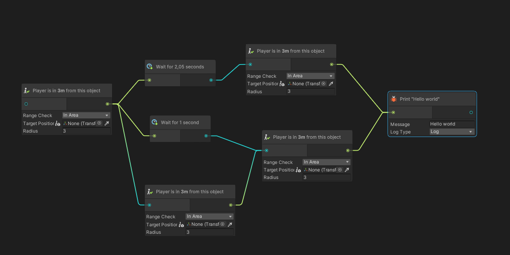
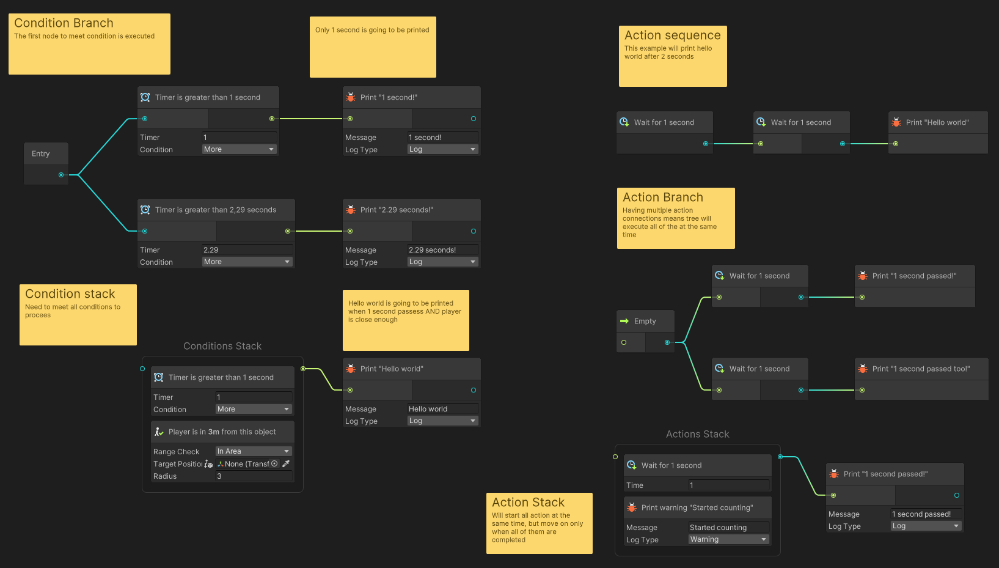
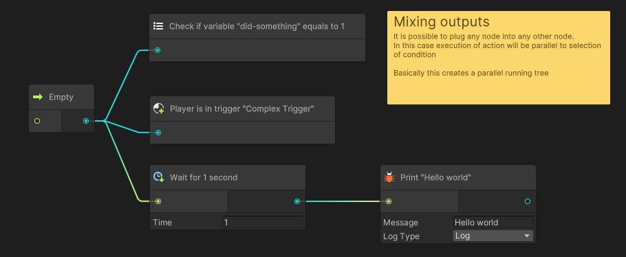
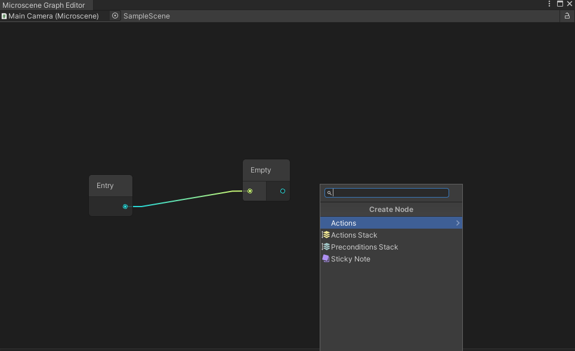

# Microscenes
Microscenes is a highly experimental visual scripting solution I developed to design small gameplay sections.
It relies heavily on providing controls with minimum amount of technical knowledge & fast iteration, without having to constantly create node database like Bolt forces you to.

Minimum tested unity version: 2020.2.5f1

**None of example nodes are presented in this package. Those rely on internal codebase and can not be easily ported. You will have to make your own node library**

All graphs are stored in scene, not as scriptable objects so nodes can contain references to scene objects without any limitations.



Microscene system uses 2 types of nodes:
* Actions
* Preconditions

The main difference is how they are executed, which is explained in the next picture.




## Creating graph
Just add Microscene component to any GameObject and open graph using corresposing button. You can also open editor window from `Window/Microscene Graph Editor` menu. This window will automatically find Microscene component in your selection and regenerate graph. You can lock the window if you don't want selection change to change graph.
Graph is saved along with the scene, when you change target object or when closing window.



Graph is then executed as soon as component is enabled in `LateUpdate()`.


## Creating nodes
To add node all you have to do is inherit your class from MicroAction or MicroPrecondition. Since every node is just a class serialized using `[SerializeReference]`, you don't need to create separate file for each one.
You node will be available in Create Node dropdown automatically.

```csharp

using Microscenes;

[SerializeReferencePath("MyNodes/Wait Action")] // Allows to specify path to node,
                                                // If this attribute is missing, class name is used
[TypeIcon("Assets/Icons/WaitActionIcon.png")]   // Can be used to add icon to a node, see Type Icon for more info
public class WaitAction : MicroAction
{
    float timer;
    [SerializeField, Min(0)] float m_Time;

    // Microscene context contains data about the caller (Microscene component)
    // and user data object that can come from context (see Context System)
    public override void OnStartExecute(in MicrosceneContext ctx)
    {
        timer = 0;
    }

    public override void OnUpdateExecute(in MicrosceneContext ctx)
    {
        timer += Time.deltaTime;
        if(timer >= m_Time)
            Complete(); // Call this to stop execution of a node
    }

    // Also both Action and Precondition have OnValidate method
}

public class SomePrecondition : MicroPrecondition
{
    bool pass;
    [SerializeField] float m_Chance = 0.5f;

    public override void Start(in MicrosceneContext ctx)
    {
        pass = Random.Range(0f, 1f) < m_Chance;
    }

    public override bool Update(in MicrosceneContext ctx)
    {
        return pass;
    }
}
```


## Type Icon
Allows to add an icon to a node. You can initialize it using string 'filter', then the next set of rules is applied:
* If filter starts with "Assets/" or "Packages/", then icon is loaded using absolute path using  [AssetDatabase.LoadAssetAtPath\<Texture>](https://docs.unity3d.com/ScriptReference/AssetDatabase.LoadAssetAtPath.html).
* If filter starts with "Resources/" then rest of the path is used for [Resources.Load(string)](https://docs.unity3d.com/ScriptReference/Resources.Load.html) call.</br>
* If filter starts with t: and contains '.' symbol, icon is retrieved from type with the same name (Must match whole name including namespace)</br>
* If filter starts with t: and <b>does not</b> contain '.', then search through types is used but only for Type.Name, first match is used to retrieve the icon. </br>
* If type is found, then rules are the same as for intiialization with `System.Type`
* If none of these criteria are met, icon is loaded using [EditorGUIUtility.IconContent(string)](https://docs.unity3d.com/ScriptReference/EditorGUIUtility.IconContent.html)

Initialization with Type works as follows:
* If type is `MonoBehaviour` then finds `MonoScript` asset and retrieves icon from it.
* If type is `ScriptableObject` then creates temporary instance and gets icon from it.
* If type is built in unity type, then `AssetPreview.GetMiniTypeThumbnail(Type)` is used

## Dynamic node name
Just implement `INameableNode` interface.
```csharp
class NamedAction : MicroAction, INameableNode
{
    [SerializeField] string m_NodeName;

    // This name will be displayed in graph view
    public string GetNiceNameString() => m_NodeName;
}
```

## Context System
So one other thing I noticed is that microscenes can be nicely used for interactions with objects, but in this case some nodes would need additional data such as lookDirection and so on. Therefore I made context system. Basically, any node can define `RequireContext` attribute, which will make it to not be available until context request is satisfied.
To provide context you have to implement `IMicrosceneContextProvider` interface. If microscene finds `IMicrosceneContextProvider` component on the same game object, it will disable itself and activation will only be possible from external source. See example

```csharp

public class InteractionData
{
    public Vector3 ViewDirection;
}

public class InteractableItem : MonoBehaviour, IMicrosceneContextProvider
{
    public Type MicrosceneContext => typeof(InteractionData);


    /// ... somewhere in code ... ///
    void enableScene(Vector3 direction)
    {
        InteractionData data = new() { ViewDirection = direction };
        GetComponent<Microscene>().StartExecutingMicroscene(data); // This will enable microscene

        // You can also check whether is completed by using
        // Microscene.IsExecutingAnyNode
    }
}

[RequireContext(typeof(InteractionData))] // Node won't be available unless Microscene has component which provides such context
public class InteractionDependentAction : MicroAction
{
    public override OnUpdateExecute(in MicrosceneContext ctx)
    {
        var interactionData = ctx.customData as InteractionData; // Given custom data
    }
}
```

## Problems
* The fact that graph is serialized in scene means we can not have actual tree because of serialization nesting limitations which adds a lot of unwanted complexity, especially for generating nodes back from serialized data. And frankly, runtime execution code looks messy as well
* Actions & Preconditions separation is used to have different execution logic, but sometimes you may have something like Timer node, which actually can act as both. And really, action & precondition nodes API is very similar, but I'm not sure how to merge these concepts just yet.
* No Undo/Redo in graph view.
* Connections to stack nodes without nodes inside are not restored when opening graph
* Since intended for internal use, some editor code is really junky, sorry if you break your leg there :)

