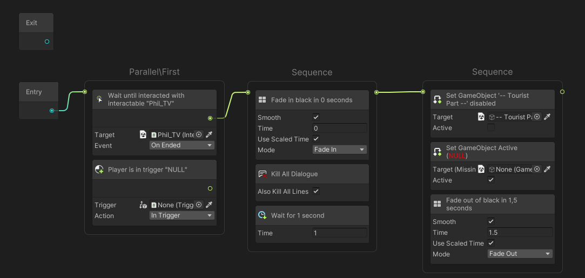
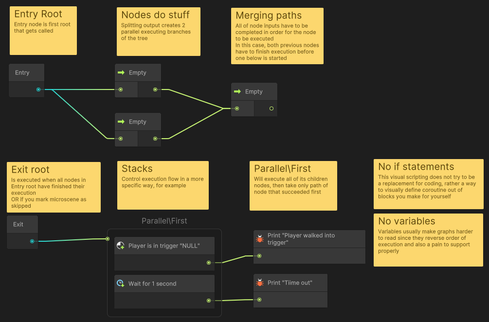
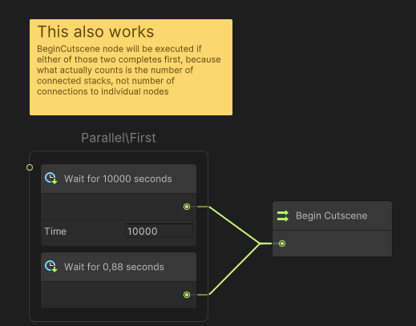
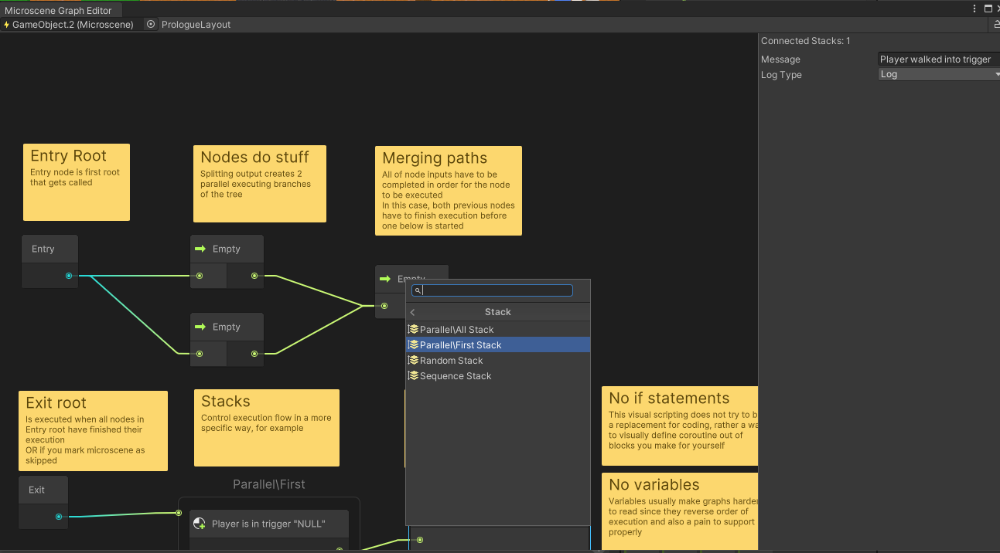

# Microscenes
Microscenes is a highly experimental visual scripting solution I developed to design small gameplay sections.
Its main idea is to provide UX with minimum need for technical knowledge & fast iteration, without having to constantly update node database like Bolt forces you to.
All graphs are stored in scene, not as scriptable objects so nodes can contain references to scene objects without any limitations. Though if you
need to save graph to asset you can always use prefabs or presets.

Please note that this is **not** one of designer-only visual scripting solutions, 
this one is actually pretty programmer oriented and will require you to write custom nodes yourself.

Minimum supported unity version: 2021.3

**Icons shown in examples are not available in this package. You can find example nodes in `Runtime/Example Nodes` directory.
The API will change in the future, no backwards compatability is guaranteed.**



Microscene system is designed for linear games that have pretty defined order of events, though I don't see much of a problem in using them elsewhere.
The idea behind this system is very simple can is described in following pictures.




Basically, you should make nodes that are suitable for your game and are abstract enough that you can describe what they do
in one actual sentence like "Wait until player is in trigger".

## Creating graph
Just add Microscene component to any GameObject and open graph using corresponding button. You can also open editor window from `Window/Microscene Graph Editor` menu. This window will automatically find Microscene component in your selection and regenerate graph. You can lock the window if you don't want selection change to change graph.
Graph is saved along with the scene, when you change target object or when closing window.



Graph is then executed as soon as component is enabled in `LateUpdate()`.


## Creating nodes
To add node all you have to do is inherit your class from MicroAction or MicroPrecondition. Since every node is just a class serialized using `[SerializeReference]`, you don't need to create separate file for each one.
You node will be available in Create Node dropdown automatically.

```csharp

using Microscenes;

[System.Serializable]                                  // Required by unity
[MicrosceneNode("Useful tooltip")]                     // Mark node to make it visible in graph window
[SerializeReferencePath(SRPathType.Abstract, "Empty")] // Enum is a shortcut to make folders, you can skip
                                                       // this attribute if you don't want custom path in node explorer
public class EmptyAction : MicrosceneNode
{
    protected override void OnStart(in MicrosceneContext ctx)
    {
        Complete();
    }
}

// Example of checking condition every frame
[SerializeReferencePath(SRPathType.Abstract, "Wait")]
class WaitNode : MicrosceneNode
{
    private double timeOverStamp;
    [SerializeField, Min(0)] float m_Time;

    // Called just before Update if node was updated for the first time 
    protected override void OnStart(in MicrosceneContext ctx)
    {
        if(m_Time == 0.0f)
        {
            // Completing from OnStart will prevent OnUpdate
            Complete();
            return;
        }
        
        timeOverStamp = Time.timeAsDouble + m_Time;
    }

    protected override void OnUpdate(in MicrosceneContext ctx)
    {
        // Use ctx.caller to debug with reference to Microscene component
        UnityEngine.Debug.Log("Time left: "+(timeOverStamp - Time.timeAsDouble), ctx.caller);
        
        if(timeOverStamp >= Time.timeAsDouble)
            Complete();
    }
    
    // NOTE: Throwing exception in OnStart on OnUpdate will lead to node being automatically completed
    // if you're in editor or debug build
    
    // These are also available
    public override void OnValidate() { }
    public override void OnDrawSceneGizmo(bool selected, Microscene owner) { }
}

```

## Custom stack nodes
You can define custom stack nodes in order to provide custom behaviour for node execution.
```csharp
using Microscenes;

// Mark with this attribute in order to make type visible in node explorer
// Also marks whether stack can handle each node leading to a different 
[MicrosceneStackBehaviour(MicrosceneStackConnectionType.SingleOutput)]
sealed class SequenceStack : MicrosceneStackBehaviour
{
    private int index;
    // Is like "Start" for default nodes
    public override void Reset(MicrosceneNode[] stack)
    {
        index = 0;
    }
    
    // 'stack' contains children of this stack
    // winnerIndex is important only for MultiOutput
    public override bool Update(in MicrosceneContext ctx, MicrosceneNode[] stack, ref int winnerIndex)
    {
        stack[index].UpdateNode(ctx);
        if(stack[index].State == MicrosceneNodeState.Finished)
            ++index;
        
        return index >= stack.Length; // Return true when stack should stop execution
    }
}

[MicrosceneStackBehaviour
(MicrosceneStackConnectionType.MultipleOutput,
 tooltip: "Will update each child node every frame and select output of a node that was completed first")]
[SerializeReferencePath("Parallel\\First Stack")]
sealed class ParallelFirstStack : MicrosceneStackBehaviour
{
    public override bool Update(in MicrosceneContext ctx, MicrosceneNode[] stack, ref int winnerIndex)
    {
        for (int i = 0; i < stack.Length; i++)
        {
            var node = stack[i];
            node.UpdateNode(ctx);

            if (node.State == MicrosceneNodeState.Finished)
            {
                // So, winnerIndex is index of a child node that 
                // should be used to continue graph execution. It has to be in [0; stack.Length) range 
                winnerIndex = i;
                return true;
            }
        }
        
        return false;
    }
}

```

## Type Icon
`TypeIconAttribute` allows to add an icon to a node. You can initialize it using string 'filter', then the next set of rules is applied:
* If filter starts with "Assets/" or "Packages/", then icon is loaded using absolute path using  [AssetDatabase.LoadAssetAtPath\<Texture>](https://docs.unity3d.com/ScriptReference/AssetDatabase.LoadAssetAtPath.html).
* If filter starts with "Resources/" then rest of the path is used for [Resources.Load(string)](https://docs.unity3d.com/ScriptReference/Resources.Load.html) call.</br>
* If filter starts with t: and contains '.' symbol, icon is retrieved from type with the same name (Must match whole name including namespace)</br>
* If filter starts with t: and <b>does not</b> contain '.', then search through types is used but only for Type.Name, first match is used to retrieve the icon. </br>
* If type is found, then rules are the same as for intiialization with `System.Type`
* If none of these criteria are met, icon is loaded using [EditorGUIUtility.IconContent(string)](https://docs.unity3d.com/ScriptReference/EditorGUIUtility.IconContent.html)

Initialization with Type works as follows:
* If type is `MonoBehaviour` then finds `MonoScript` asset and retrieves icon from it.
* If type is `ScriptableObject` then creates temporary instance and gets icon from it.
* If type is built in unity type, then `AssetPreview.GetMiniTypeThumbnail(Type)` is used

## Dynamic node name
Just implement `INameableNode` interface. This will make graph view will set node name to whetever GetNiceNameString returns.
Rich text is supported.
```csharp
class NamedAction : MicrosceneNode, INameableNode
{
    [SerializeField] string m_NodeName;

    // This name will be displayed in graph view
    string INameableNode.GetNiceNameString() => m_NodeName;
}
```

## Context System
So one other thing I noticed is that microscenes can be nicely used for interactions with objects, but in this case some nodes would need additional data such as lookDirection and so on. Therefore I made context system. Basically, any node can define `RequireContext` attribute, which will make it to not be available until context request is satisfied.
To provide context you have to implement `IMicrosceneContextProvider` interface. If microscene finds `IMicrosceneContextProvider` component on the same game object, it will disable itself and activation will only be possible from external source. See example

```csharp

public class InteractionData
{
    public Vector3 ViewDirection;
}

public class InteractableItem : MonoBehaviour, IMicrosceneContextProvider
{
    public Type MicrosceneContext => typeof(InteractionData);


    /// ... somewhere in code ... ///
    void enableScene(Vector3 direction)
    {
        InteractionData data = new() { ViewDirection = direction };
        GetComponent<Microscene>().StartExecutingMicroscene(data); // This will enable microscene

        // You can also check whether is completed by using
        // Microscene.IsExecutingAnyNode
    }
}

[RequireContext(typeof(InteractionData))] // Node won't be available unless Microscene has component which provides such context
public class InteractionDependentAction : MicrosceneNode
{
    protected override void OnUpdate(in MicrosceneContext ctx)
    {
        var interactionData = ctx.customData as InteractionData; // Get custom data
    }
}
```

## Problems
* No Undo/Redo in graph view.
* You can't really modify graph at runtime in a way that won't break it. I didn't have a need for it yet and I also don't know how would you implement such a thing
* Connections to stack nodes without nodes inside are not restored when opening graph
* Since intended for internal use, some editor code is really junky, sorry if you break your leg there :)
* Apparently, graph view is going to get [deprecated](https://forum.unity.com/threads/graph-tool-foundation.1057667/page-2#post-8098055). Great =)
* Search window in graph view is not very good and repeats some entries on search
* No loops (Don't know if that's a problem actually)

